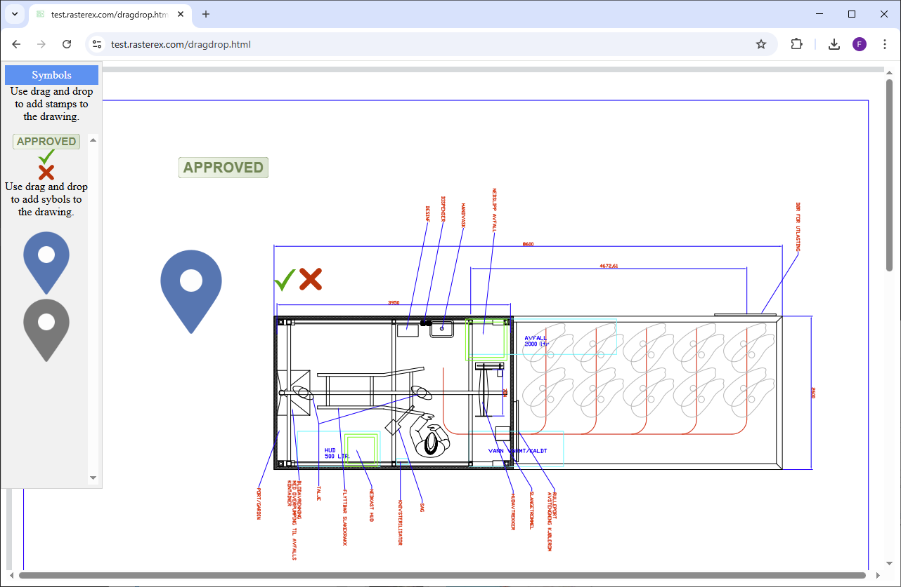

Using any image source as a stamps require the implementation of a simple drag and drop handling.
We support both PNG and SVG image data sources.

This general method relate to the following, [RxCore.addSignature](../markup-annotations/methods/addSignature), [RxCore.markupImageStamp](../markup-annotations/methods/markupImageStamp) and [RxCore.markupSymbol](../markup-annotations/methods/markupSymbol).


Given an image source defined as shown below.

```html


```

You can handle the drag and drop functionality using the following drag and drop event methods.
Our newer back-end can handle svg data and create PDF stamps using vector graphics for a better result.
For this to work the svgContent property must be set with valid SVG markup.


```JavaScript

        function dragstamp(ev) {
            var imageobject = document.getElementById(ev.target.id)

            var width = ev.target.naturalWidth;
            var height = ev.target.naturalHeight;

            if (ev.target.id === 'symbol4') {
                width = 128;
                height = 30;

                var svgElement = document.getElementById("symbol4svg");

                
                var serializer = new XMLSerializer();
                var svgContent = serializer.serializeToString(svgElement);
                

            }

            if (ev.target.id === 'symbol5') {
                width = 32;
                height = 32;

                svgElement = document.getElementById("symbol5svg");

                // Get the raw SVG markup as a string
                serializer = new XMLSerializer();
                svgContent = serializer.serializeToString(svgElement);

                
            }

            if (ev.target.id === 'symbol6') {
                width = 32;
                height = 32;

                svgElement = document.getElementById("symbol6svg");
                // Get the raw SVG markup as a string
                serializer = new XMLSerializer();
                svgContent = serializer.serializeToString(svgElement);

            }


            var mydragobject= {
                src: imageobject.src,
                width: width,
                height: height,
                id: ev.target.id,
                svgContent : svgContent
            };      
            ev.dataTransfer.setData("text", JSON.stringify(mydragobject));
            RxCore.markupImageStamp(true);
        }   
        
        function dragend(ev)    {
            RxCore.markupImageStamp(false);
        }   

```

### Export the result. 
Use Exportfile to export the result of the added stamps and symbol to a new PDF file.
You can handle the export result using the RxCore.GUI_exportComplete callback.


```JavaScript

        function exportfile(){
            RxCore.exportFile(false, "PDF", "0", "A4", "1");

        }


            RxCore.GUI_exportComplete.connect(function (fileUrl) {
                //open exported pdf in a new window
                window.open(fileUrl, '_new');
            });

```

### Full example




```html

<html>
<head>
    <style>
        
    .hiddensvg {
        display : none;
    }    
    #rxcontainer {
        position: relative;
        width: 100%;
        height: 100%;
        display: block;
        margin: 0;
        padding: 0;
        border: 0;
        overflow: hidden;
    }
    
    #rxcanvas { border: 1px solid #000; }
    #imageDisp { position: absolute; top: 1px; left: 1px; }
    #imageTemp { position: absolute; top: 1px; left: 1px; }
    #canv3D {
        position: absolute; top: 1px; left: 1px;
        background: -webkit-linear-gradient(#FFFFFF, #b5b5b5); /* Safari 5.1-6.0 */
        background: -o-linear-gradient(#FFFFFF, #b5b5b5);      /* Opera 11.1-12.0 */
        background: -moz-linear-gradient(#FFFFFF, #b5b5b5);    /* Firefox 3.6-15 */
        background: linear-gradient(#FFFFFF, #b5b5b5);         /* Standard syntax */
    }

    #symbols{
      position: absolute;
      z-index: 9;
      background-color: #f1f1f1;
      border: 1px solid #d3d3d3;
      text-align: center;
      top: 0px; 
      left:0px;
      padding: 5px;
      user-select:none;
   }
   #symbolsheader {
      cursor: move;
      z-index: 10;
      background-color: #2196F3;
      color: #fff;
      padding: 5px;
      user-select:none;
   }    
   #symbolslist{
      overflow-y:scroll;
      height: 500px;
   }


    </style>
</head>

<body>

    <div id="symbols">
        <div id="symbolsheader">Symbols</div>
         Use drag and drop<br> to add stamps to <br> the drawing.
         <p>
        <div id="symbolslist">


            <svg id="symbol4svg" xmlns="http://www.w3.org/2000/svg" width="224" height="52" viewBox="0 0 224 52" fill="none" class="hiddensvg">
                    <defs>
                    <linearGradient id="Gradient">
                        <stop stop-color="#f2f7ec" offset="0%" />
                        <stop stop-color="#d6e4cf" offset="100%" />
                    </linearGradient>
                    </defs>
                    <rect width="224" height="52" rx="8" ry="8" stroke="#698753" stroke-width="1" fill="url(#Gradient)"/>
                    <text x="112" y="38" font-family="Arial" 
                    font-size="36" text-anchor="middle" fill="#698753"
                    font-weight="bolder"
                    textLength="200"
                    lengthAdjust="spacingAndGlyphs"
                    >APPROVED</text>
            </svg>


              </img><br>


            <svg id="symbol5svg" version="1.1"  xmlns="http://www.w3.org/2000/svg" xmlns:xlink="http://www.w3.org/1999/xlink" x="0px" y="0px" viewBox="0 0 122.88 109.76" class="hiddensvg" xml:space="preserve">
                <style type="text/css">.st0{fill-rule:evenodd;clip-rule:evenodd;fill:#01A601;}</style>
                <g>
                    <path class="st0" d="M0,52.88l22.68-0.3c8.76,5.05,16.6,11.59,23.35,19.86C63.49,43.49,83.55,19.77,105.6,0h17.28 C92.05,34.25,66.89,70.92,46.77,109.76C36.01,86.69,20.96,67.27,0,52.88L0,52.88z"/>
                </g>
            </svg>


              </img><br>

            <svg id="symbol6svg" xmlns="http://www.w3.org/2000/svg" xmlns:xlink="http://www.w3.org/1999/xlink" version="1.1" width="22" height="22" viewBox="0 0 256 256" xml:space="preserve" class="hiddensvg">
                <g style="stroke: none; stroke-width: 0; stroke-dasharray: none; stroke-linecap: butt; stroke-linejoin: miter; stroke-miterlimit: 10; fill: none; fill-rule: nonzero; opacity: 1;" transform="translate(1.4065934065934016 1.4065934065934016) scale(2.81 2.81)">
                    <path d="M 11 90 c -2.815 0 -5.63 -1.074 -7.778 -3.222 c -4.295 -4.296 -4.295 -11.261 0 -15.557 l 68 -68 c 4.297 -4.296 11.26 -4.296 15.557 0 c 4.296 4.296 4.296 11.261 0 15.557 l -68 68 C 16.63 88.926 13.815 90 11 90 z" style="stroke: none; stroke-width: 1; stroke-dasharray: none; stroke-linecap: butt; stroke-linejoin: miter; stroke-miterlimit: 10; fill: rgb(214,0,0); fill-rule: nonzero; opacity: 1;" transform=" matrix(1 0 0 1 0 0) " stroke-linecap="round"/>
                    <path d="M 79 90 c -2.815 0 -5.63 -1.074 -7.778 -3.222 l -68 -68 c -4.295 -4.296 -4.295 -11.261 0 -15.557 c 4.296 -4.296 11.261 -4.296 15.557 0 l 68 68 c 4.296 4.296 4.296 11.261 0 15.557 C 84.63 88.926 81.815 90 79 90 z" style="stroke: none; stroke-width: 1; stroke-dasharray: none; stroke-linecap: butt; stroke-linejoin: miter; stroke-miterlimit: 10; fill: rgb(214,0,0); fill-rule: nonzero; opacity: 1;" transform=" matrix(1 0 0 1 0 0) " stroke-linecap="round"/>
                </g>
            </svg>


              </img><br>
         
             Use drag and drop<br> to add sybols to <br> the drawing.
             <p>

             </img><br>
             </img><br>


        </div>

        <button onclick="exportfile()">Export</button>

    </div>

    <div id="rxcontainer">
    </div>

    <script src="assets/scripts/foxiframeconnect.js"></script>
    <script src="assets/scripts/rxconfig.js"></script>
    <script src="assets/scripts/rxcorefunctions.js"></script>
    <script type="text/javascript" src="assets/scripts/three.min.js"></script>
    <script type="text/javascript" src="assets/scripts/detector.js"></script>
    <script type="text/javascript" src="assets/scripts/GLTFLoader.js"></script>
    <script type="text/javascript" src="assets/scripts/jquery-2.1.0.min.js"></script>
    <script src="dragelement.js"></script>

    <script type="text/javascript" charset="utf-8">


        var bguireadycalled = false;
        var bfoxitreadycalled = false;
        var binitfileopened = false;


        function exportfile(){

            RxCore.exportFile(false, "PDF", "0", "A4", "1");

        }

        function dragsymbol(ev) {

            var imageobject = document.getElementById(ev.target.id)


            var width = ev.target.naturalWidth;
            var height = ev.target.naturalHeight;

            var mydragobject= {
                src: imageobject.src,
                width: width,
                height: height,
                id: ev.target.id,
                
            };      
            ev.dataTransfer.setData("text", JSON.stringify(mydragobject));
            RxCore.markupSymbol(true);


        }

        function dragstamp(ev) {
            var imageobject = document.getElementById(ev.target.id)

            var width = ev.target.naturalWidth;
            var height = ev.target.naturalHeight;

            if (ev.target.id === 'symbol4') {
                width = 128;
                height = 30;

                var svgElement = document.getElementById("symbol4svg");

                
                var serializer = new XMLSerializer();
                var svgContent = serializer.serializeToString(svgElement);
                

            }

            if (ev.target.id === 'symbol5') {
                width = 32;
                height = 32;

                svgElement = document.getElementById("symbol5svg");

                // Get the raw SVG markup as a string
                serializer = new XMLSerializer();
                svgContent = serializer.serializeToString(svgElement);

                
            }

            if (ev.target.id === 'symbol6') {
                width = 32;
                height = 32;

                svgElement = document.getElementById("symbol6svg");
                // Get the raw SVG markup as a string
                serializer = new XMLSerializer();
                svgContent = serializer.serializeToString(svgElement);

            }


            var mydragobject= {
                src: imageobject.src,
                width: width,
                height: height,
                id: ev.target.id,
                svgContent : svgContent
            };      
            ev.dataTransfer.setData("text", JSON.stringify(mydragobject));
            RxCore.markupImageStamp(true);
        }   

        function dragsymbolend(ev)    {
            RxCore.markupSymbol(false);

        }   


        function dragstampend(ev)    {
            RxCore.markupImageStamp(false);
        }   


        $(document).ready(function () {


            dragElement(document.getElementById(("symbols")));

            //file to open on startup
            var drawing = "E:\\\\Rasterex\\\\Upload\\\\040915 MOBSLAKT.pdf";
            var canvdim = {
                offsetWidth: 0,
                offsetHeight: 0
            };

            RxCore.initialize(canvdim);

            RxCore.GUI_Ready.connect(function () {
                addFoxitdocBarebone();
                bguireadycalled = true;

                openInitFile(drawing);

            });

            RxCore.GUI_FoxitReady.connect(function () {

                bfoxitreadycalled = true;
                openInitFile(drawing);

                RxCore.GUI_FileLoadComplete.connect(function (fileurl, activefile) {

                    console.log(fileurl);

                });

            });

            RxCore.GUI_exportComplete.connect(function (fileUrl) {
                //open exported pdf in a new window
                window.open(fileUrl, '_new');
            });

        });


        function openInitFile(initialDoc) {

            if (bguireadycalled && bfoxitreadycalled) {
                if (binitfileopened == false) {
                    binitfileopened = true;
                    RxCore.openFile(initialDoc);
                }
            }
        }


    </script>
</body>

</html>

```