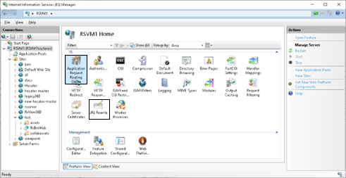
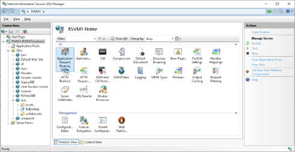
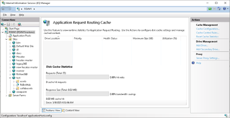
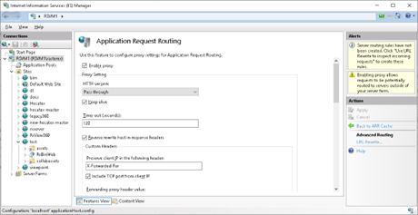
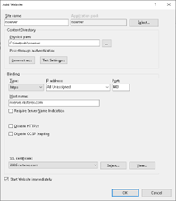
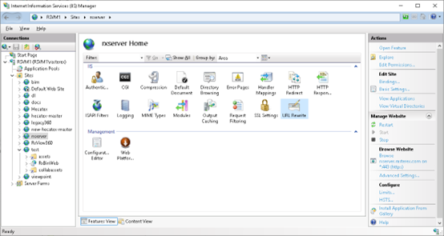
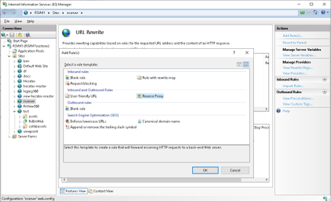
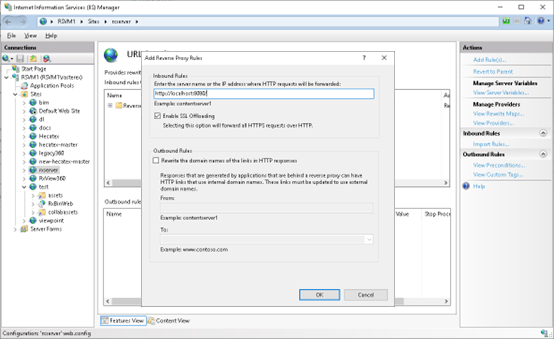

# Configure IIS reverse proxy
   - For production with HTTPS access, configure IIS with ARR + URL Rewrite  
   

This guide explains how to configure IIS with **Application Request Routing (ARR)** and **URL Rewrite** to act as a reverse proxy for the rx-back-end service.

---

## 1. Install ARR and URL Rewrite

- [Download and install ARR](https://www.microsoft.com/en-us/download/details.aspx?id=47333)  
- [Download and install URL Rewrite](https://www.iis.net/downloads/microsoft/url-rewrite)  

After installation, restart IIS Manager. You should see **Application Request Routing Cache** available.  



---

## 2. Enable Proxy in IIS

1. Open **IIS Manager**  
2. Select the server in the left-hand tree  
3. Double-click **Application Request Routing Cache**  
4. In the right-hand **Actions** panel, click **Server Proxy Settings**  
5. Check **Enable proxy** and click **Apply**  








---

## 3. Create a New Website

1. In IIS Manager, expand **Sites**  
2. Right-click **Sites** → **Add Website**  
3. Configure the site:  
   - **Site name**: e.g. `rx-proxy`  
   - **Physical path**: any empty folder  
   - **Binding type**: `https`  
   - **SSL certificate**: choose your certificate  




---

## 4. Configure URL Rewrite Rule

1. Select the new website in the left-hand tree  
2. Double-click **URL Rewrite**  
3. In the **Actions** pane, click **Add Rules…**  
4. Select **Reverse Proxy** and click **OK**  
5. In the dialog, set the backend address:  
   ```
   http://localhost:8080
   ```
6. Save the rule  

⚠️ Note: Sometimes IIS adds `http://http://` in the rule. If so, edit the rule and fix the URL.  








---

## 5. Test the Setup

- Open a browser and navigate to your public site:  
  ```
  https://yourserver.yourdomain.com/
  ```  
- It should proxy requests to the Node.js backend running at:  
  ```
  http://localhost:8080/
  ```  

---

✅ IIS is now configured as a secure reverse proxy for rx-back-end.
   
   
